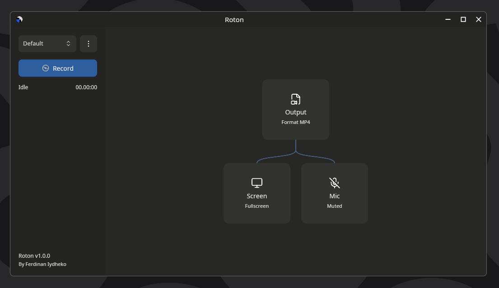

# Roton Screen Recorder

Roton v1.0.1 is a fast Wayland screen recorder built with Rust and Iced. It wraps `wl-screenrec` with a small GUI so recording does not have to live in the terminal.




## About

I wanted a quick performance screen recorder app. Then I found `wl-screenrec`, and it was fast enough that I stopped using bigger studio apps. The only catch was that it runs from the CLI, so Roton gives it a GUI.

Roton can record fullscreen, a selected monitor, or a selected area. You can choose the output format, include or hide the cursor, record screen audio, record a microphone, mute audio, pause and resume recordings, and keep the app available from the tray.

## Features

- `wl-screenrec` recording backend
- MP4, MKV, and WEBM output
- fullscreen, monitor, or `scrop` area recording
- optional cursor capture
- optional screen audio capture
- optional microphone capture
- pause/resume by segmenting recordings and concatenating with `ffmpeg`
- recording completion notification
- custom titlebar with minimal window controls
- tray icon and optional minimize-to-tray close behavior
- close confirmation while recording when minimize-to-tray is off

## Run This Project

1. Install Rust by following the [getting-started guide](https://www.rust-lang.org/learn/get-started). After that, `rustc` and `cargo` should be available in your `PATH`.
2. Install the runtime tools:

   ```sh
   sudo pacman -S ffmpeg xdg-desktop-portal pipewire-pulse
   yay -S scrop-bin
   ```

   Roton also needs `wl-screenrec` and `pactl`. Install them from your preferred Arch repo/AUR source if they are not already available.

3. Clone this repository:

   ```sh
   git clone https://github.com/ferdinankurnian/roton-iced.git
   cd roton-iced
   ```

4. Build with `cargo`:

   ```sh
   cargo build
   ```

5. Run the application:

   ```sh
   cargo run
   ```

## Runtime Tools

Roton needs these tools at runtime:

- `ffmpeg`
- `xdg-desktop-portal`
- `pipewire-pulse`
- `wl-screenrec`
- `scrop`
- `pactl`

Tray support also needs an AppIndicator runtime:

- `libayatana-appindicator3` or `libappindicator3`

## Notes

- Roton v1.0.1 targets Wayland only.
- Audio devices are read from `pactl list sources`.
- Screen area selection uses `scrop`.
- Tray support uses StatusNotifier/AppIndicator through `tray-icon`.
